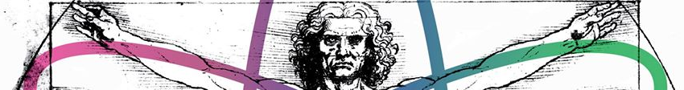

# Introducción a Física de Partículas, Nuclear, Aceleradores y Detectores

Curso de Introducción a la Física de Partículas, Física Nuclear, Aceleradores y Detectores presentado durante la Escuela José Antonio Balseiro - Nuevas Tendencias en Investigación en Física Médica 

Octubre 2016 - Centro Atómico Bariloche e [Instituto Balseiro](https://www.ib.edu.ar)

## Información importante

Este commit correponde a la última edición del curso (2016). Con este commit y release se da por cerrado el repositorio.

Todo este material ha sido liberado utilizando una licencia de dominio público creative commons [CC0-1.0-Universal](https://creativecommons.org/publicdomain/zero/1.0/). Por favor revise los [términos de la licencia](#licencia) antes de su uso.

Las clases fueron realizados en [LibreOffice Impress](https://es.libreoffice.org/descubre/impress/), la herramienta de presentaciones de [LibreOffice](https://es.libreoffice.org/). Para poder visualizar correctamente las clases, por favor descarguelo siguiendo el este enlace: **[Descargue LibreOffice](https://es.libreoffice.org/descarga/libreoffice-estable/)**. En Windows, puede ser necesario descargar también la fuente [Cabin](https://www.fontsquirrel.com/fonts/download/cabin). Para facilitar la difusión, se incluyen también versiones de las clases en formato pdf. Para visualizarlo, podría necesitar descargar [Acrobat Reader](https://get.adobe.com/es/reader).

## Contenido

El curso consta de cuatro clases de aproximadamente tres horas y media cada una, cubriendo los siguientes tópicos a un nivel introductorio:

* Clase 1: Cinemática y Dinámica Relativista. Interacciones fundamentales. Física de partículas. Generalidades sobre el Modelo Estándar
* Clase 2: Cargas conservadas y simetrías de la Naturaleza. El núcleo atómico: energía de ligadura, defecto y exceso de masa. Estabilidad nuclear. Momento angular, espín y paridad. El modelo de capas. Radiactividad.
* Clase 3: Decaimientos radiactivos. Actividad. Unidades. Tipos de decaimiento y descripción de los principales. Ejemplos de núcleos radiactivos de uso médico e industrial y sus principales líneas de emisión. Física de Aceleradores: principios de funcionamiento y tipos. Sección eficaz y luminosidad. 
* Clase 4: Interacción de la radiación con la materia: poder de frenado, pico de Bragg, rango, longitud de interacción, energía crítica, coeficientes de atenuación lineal y másico. Características de detectores de uso en física de partículas: fototubos, fotomultiplicadores de silicio, Cherenkov y centelleo.

En las clases se incluyen algunos ejercicios y problemas y bibliografía recomendada. Se incluye tambien el código stopping.py (python v2.7) para calcular el pico de Bragg y el rango de partículas cargadas en medios materiales.  

## Licencia

(C) 2016 - Hernán Asorey

<a property="dct:title" rel="cc:attributionURL" href="https://github.com/asoreyh/intro-nuclear-fisica-medica/">Introducción a Física de Partículas, Nuclear, Aceleradores y Detectores (Escuela JAB2016 IB)</a> by <a rel="cc:attributionURL dct:creator" property="cc:attributionName" href="https://github.com/asoreyh/">Hernán Asorey</a> is marked with <a href="https://creativecommons.org/publicdomain/zero/1.0/?ref=chooser-v1" target="_blank" rel="license noopener noreferrer" style="display:inline-block;">CC0 1.0 Universal</a>.
